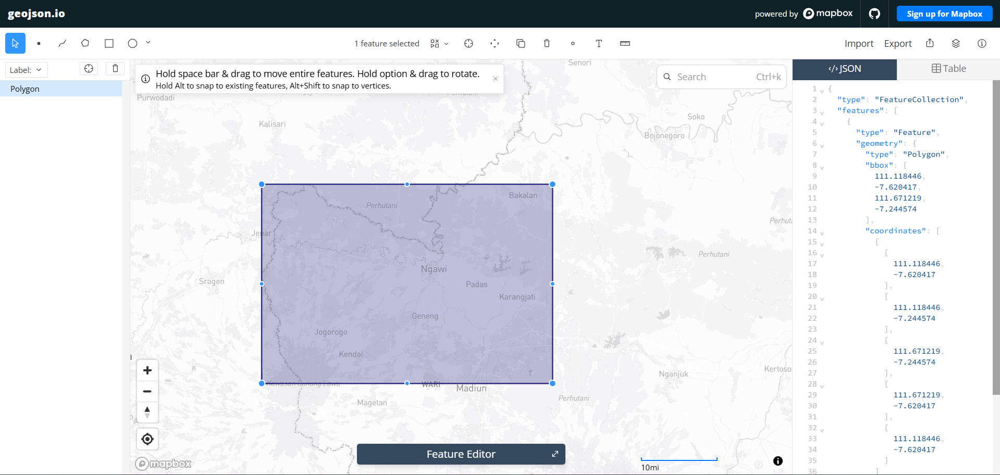

---
jupytext:
  formats: md:myst
  text_representation:
    extension: .md
    format_name: myst
    format_version: 0.13
    jupytext_version: 1.11.5
kernelspec:
  display_name: Python 3
  language: python
  name: python3
---

# Data Understanding

## Data Collection

Langkah pertama dalam proyek ini adalah mengumpulkan data polutan udara (seperti NO₂, SO₂, O₃, dan CO) yang bertipe deret waktu (_Time Series_) untuk wilayah **Kabupaten Ngawi**. Dataset ini diambil dari platform satelit [Copernicus Data Space Ecosystem](https://dataspace.copernicus.eu/) menggunakan library `openeo`.

### Install Library

Untuk melakukan proses crawling data, kita membutuhkan pustaka Python pendukung yaitu `openeo` untuk berkomunikasi dengan API Copernicus.

```bash
pip install openeo
```

### Autentikasi dan Pengambilan Data

Skrip di bawah ini melakukan proses autentikasi untuk menghubungkan sistem lokal kita dengan server Copernicus menggunakan _device code flow_.

```python
import openeo

connection = openeo.connect("openeo.dataspace.copernicus.eu").authenticate_oidc()
```

Saat menjalankan baris di atas, akan muncul permintaan autentikasi:

```
Visit (link authentikasi) 📋 to authenticate.
✅ Authorized successfully
Authenticated using device code flow.
```

Klik link autentikasi lalu login menggunakan akun Copernicus.
### Autentikasi dan Definisi Area

Setelah berhasil masuk, langkah selanjutnya adalah menentukan wilayah spesifik. Titik koordinat batas wilayah Ngawi (Poligon) didapatkan menggunakan alat bantu pemetaan [geojson.io](https://geojson.io) dengan menggambar kotak di atas wilayah yang diinginkan kemudian menyalin koordinatnya.



Koordinat yang didapatkan dimasukkan ke dalam variabel `aoi` (Area of Interest). Satelit Sentinel-5P kemudian diminta untuk mengambil data polutan berdasarkan _bounding box_ wilayah tersebut dengan menyesuaikan variabel `s5post` atribut `bands`. 

Karena satelit mungkin merekam area yang sama beberapa kali, dilakukan **agregasi temporal harian** agar hanya terdapat rata-rata satu data per hari. Dilanjutkan dengan **agregasi spasial** agar seluruh _grid_ pada wilayah Ngawi dirata-rata menjadi satu nilai tunggal.

```python
ngawi_bbox = {
    "west": 111.118446,
    "south": -7.620417,
    "east": 111.671219,
    "north": -7.244574
}

aoi = {
    "type": "Polygon",
    "coordinates": [
        [
            [111.118446, -7.620417],
            [111.118446, -7.244574],
            [111.671219, -7.244574],
            [111.671219, -7.620417],
            [111.118446, -7.620417],
        ]
    ]
}
```

### Pengambilan Data NO₂, SO₂, O₃, dan CO

Data diambil untuk periode 25 Agustus 2025 hingga 25 Agustus 2026, dengan agregasi harian (temporal) dan agregasi spasial agar seluruh grid wilayah Ngawi dirata-rata menjadi satu nilai per hari.

```python
daftar_polutan = ["NO2", "SO2", "O3", "CO"]

for polutan in daftar_polutan:
    s5p = connection.load_collection(
        "SENTINEL_5P_L2",
        temporal_extent=["2025-08-25", "2026-08-25"],
        spatial_extent=ngawi_bbox,
        bands=[polutan],
    )
    s5p_daily = s5p.aggregate_temporal_period(reducer="mean", period="day")
    s5p_aoi = s5p_daily.aggregate_spatial(reducer="mean", geometries=aoi)

    result = s5p_aoi.save_result(format="CSV")
    job = result.create_job(title=f"s5p_{polutan.lower()}_ngawi")
    job.start_and_wait()
    job.get_results().download_files(f"output_{polutan.lower()}_ngawi")
```

### Hasil CSV

Berikut cuplikan data mentah hasil pengambilan (sebelum dinormalisasi):

1. NO₂

```{code-cell}
:tags: [hide-input]
import pandas as pd
df = pd.read_csv("../../data/polutan/NO2.csv")
df.head(5)
```

2. SO₂

```{code-cell}
:tags: [hide-input]
df = pd.read_csv("../../data/polutan/SO2.csv")
df.head(5)
```

3. O₃

```{code-cell}
:tags: [hide-input]
df = pd.read_csv("../../data/polutan/O3.csv")
df.head(5)
```

4. CO

```{code-cell}
:tags: [hide-input]
df = pd.read_csv("../../data/polutan/CO.csv")
df.head(5)
```

### Normalisasi Tanggal

Kolom `date` hasil openEO menyertakan format ISO dengan zona waktu (`...T00:00:00.000Z`) dan kolom `feature_index` yang tidak diperlukan (selalu bernilai 0 karena AOI hanya satu polygon). Kolom ini dinormalisasi menjadi format `YYYY-MM-DD` dan kolom `feature_index` dibuang:

```python
import pandas as pd

daftar_polutan = ["NO2", "SO2", "O3", "CO"]

for polutan in daftar_polutan:
    df = pd.read_csv(f"{polutan}.csv")
    df["date"] = pd.to_datetime(df["date"], errors="coerce")
    df["date"] = df["date"].dt.strftime("%Y-%m-%d")

    new_df = pd.DataFrame({
        "date": df["date"],
        polutan: df[polutan]
    })
    new_df.to_csv(f"{polutan}_Timeseries.csv", index=False)
```

Berikut cuplikan dataset setelah tanggal dinormalisasi:

1. NO₂

```{code-cell}
:tags: [hide-input]
df = pd.read_csv("../../data/polutan/NO2_Timeseries.csv")
df.head(5)
```

2. SO₂

```{code-cell}
:tags: [hide-input]
df = pd.read_csv("../../data/polutan/SO2_Timeseries.csv")
df.head(5)
```

3. O₃

```{code-cell}
:tags: [hide-input]
df = pd.read_csv("../../data/polutan/O3_Timeseries.csv")
df.head(5)
```

4. CO

```{code-cell}
:tags: [hide-input]
df = pd.read_csv("../../data/polutan/CO_Timeseries.csv")
df.head(5)
```

## Missing Values

_Missing values_ (nilai yang hilang) adalah kondisi di mana terdapat informasi yang kosong atau tidak terekam dalam dataset. Pada data satelit, kekosongan ini umumnya terjadi akibat tutupan awan atau orbit satelit yang tidak merekam area tersebut pada hari tertentu.

Pada proyek ini, dicek dua bentuk _missing values_:
1. **Tanggal yang Hilang**: memastikan tidak ada hari yang terlewat dari rentang 25 Agustus 2025 – 25 Agustus 2026.
2. **Data yang Hilang**: memeriksa jumlah nilai polutan yang kosong (`NaN`) pada tanggal yang sudah terekam.

### Tanggal yang Hilang

```{code-cell}
import pandas as pd

start_date = "2025-08-25"
end_date   = "2026-08-25"
full_range = pd.date_range(start=start_date, end=end_date, freq='D')

for polutan in ["NO2", "SO2", "O3", "CO"]:
    df = pd.read_csv(f"../../data/polutan/{polutan}_Timeseries.csv")
    df['date'] = pd.to_datetime(df['date'])
    missing_dates = full_range.difference(df['date'])
    print(f"{polutan}: jumlah hari missing = {len(missing_dates)}")
```

Hasilnya menunjukkan bahwa tidak ada tanggal yang benar-benar bolong — satelit tetap merekam setiap hari dalam rentang waktu tersebut, namun sebagian nilainya kosong (dibahas di bagian berikutnya).

### Data yang Hilang

```{code-cell}
for polutan in ["NO2", "SO2", "O3", "CO"]:
    df = pd.read_csv(f"../../data/polutan/{polutan}_Timeseries.csv")
    missing_value = df[polutan].isna().sum()
    print(f"{polutan}: {missing_value} dari {len(df)} baris kosong ({missing_value/len(df)*100:.2f}%)")
```

NO₂ memiliki proporsi nilai kosong tertinggi (~18%), diikuti SO₂ (~11%) dan CO (~11%), sementara O₃ paling sedikit (~1%) — wajar karena sensor NO₂ lebih sensitif terhadap tutupan awan dibanding O₃.

## Outliers

_Outliers_ (pencilan) adalah titik data yang menyimpang drastis dari mayoritas distribusi data lainnya. Bisa jadi merupakan lonjakan polusi nyata (misalnya kebakaran hutan atau aktivitas industri mendadak), atau sekadar _noise_ pembacaan sensor satelit.

Deteksi outlier dilakukan menggunakan algoritma **Isolation Forest** dari `scikit-learn`. Algoritma ini bekerja dengan cara "mengisolasi" tiap titik data melalui pemisahan secara acak berkali-kali — titik data yang anomali akan lebih cepat terisolasi dibanding titik data normal. Parameter _contamination_ diatur sebesar 5%, yang berarti model diasumsikan sekitar 5% dari data adalah outlier. Hasil prediksi bernilai `-1` menandakan baris tersebut terdeteksi sebagai outlier.

### NO₂

```{code-cell}
import pandas as pd
import matplotlib.pyplot as plt
from sklearn.ensemble import IsolationForest

df = pd.read_csv("../../data/polutan/NO2_Timeseries.csv")
df_clean = df.dropna(subset=['NO2']).copy()
df_clean['date'] = pd.to_datetime(df_clean['date'])
df_clean = df_clean.sort_values('date').reset_index(drop=True)

model = IsolationForest(contamination=0.05, random_state=42)
pred = model.fit_predict(df_clean[['NO2']])
df_clean['anomaly'] = pred

outliers_if = df_clean[df_clean['anomaly'] == -1]
print("Jumlah outlier:", len(outliers_if))
print(outliers_if[['date', 'NO2']].head())
```

```{code-cell}
plt.figure(figsize=(15, 5))
plt.plot(df_clean['date'], df_clean['NO2'], label="NO2", linewidth=1)
plt.scatter(outliers_if['date'], outliers_if['NO2'],
            color='red', marker='o', label="Outliers (Isolation Forest)")
plt.title("Deteksi Outlier Data NO2 (Metode Isolation Forest)")
plt.xlabel("Tanggal")
plt.ylabel("Kadar NO2")
plt.legend()
plt.tight_layout()
plt.xticks(
    ticks=[df_clean['date'].iloc[0], df_clean['date'].iloc[-1]],
    labels=[df_clean['date'].iloc[0].strftime('%Y-%m-%d'),
            df_clean['date'].iloc[-1].strftime('%Y-%m-%d')]
)
plt.show()
```

### SO₂

```{code-cell}
df = pd.read_csv("../../data/polutan/SO2_Timeseries.csv")
df_clean = df.dropna(subset=['SO2']).copy()
df_clean['date'] = pd.to_datetime(df_clean['date'])
df_clean = df_clean.sort_values('date').reset_index(drop=True)

model = IsolationForest(contamination=0.05, random_state=42)
pred = model.fit_predict(df_clean[['SO2']])
df_clean['anomaly'] = pred

outliers_if = df_clean[df_clean['anomaly'] == -1]
print("Jumlah outlier:", len(outliers_if))
print(outliers_if[['date', 'SO2']].head())
```

```{code-cell}
plt.figure(figsize=(15, 5))
plt.plot(df_clean['date'], df_clean['SO2'], label="SO2", linewidth=1)
plt.scatter(outliers_if['date'], outliers_if['SO2'],
            color='red', marker='o', label="Outliers (Isolation Forest)")
plt.title("Deteksi Outlier Data SO2 (Metode Isolation Forest)")
plt.xlabel("Tanggal")
plt.ylabel("Kadar SO2")
plt.legend()
plt.tight_layout()
plt.xticks(
    ticks=[df_clean['date'].iloc[0], df_clean['date'].iloc[-1]],
    labels=[df_clean['date'].iloc[0].strftime('%Y-%m-%d'),
            df_clean['date'].iloc[-1].strftime('%Y-%m-%d')]
)
plt.show()
```

### O₃

```{code-cell}
df = pd.read_csv("../../data/polutan/O3_Timeseries.csv")
df_clean = df.dropna(subset=['O3']).copy()
df_clean['date'] = pd.to_datetime(df_clean['date'])
df_clean = df_clean.sort_values('date').reset_index(drop=True)

model = IsolationForest(contamination=0.05, random_state=42)
pred = model.fit_predict(df_clean[['O3']])
df_clean['anomaly'] = pred

outliers_if = df_clean[df_clean['anomaly'] == -1]
print("Jumlah outlier:", len(outliers_if))
print(outliers_if[['date', 'O3']].head())
```

```{code-cell}
plt.figure(figsize=(15, 5))
plt.plot(df_clean['date'], df_clean['O3'], label="O3", linewidth=1)
plt.scatter(outliers_if['date'], outliers_if['O3'],
            color='red', marker='o', label="Outliers (Isolation Forest)")
plt.title("Deteksi Outlier Data O3 (Metode Isolation Forest)")
plt.xlabel("Tanggal")
plt.ylabel("Kadar O3")
plt.legend()
plt.tight_layout()
plt.xticks(
    ticks=[df_clean['date'].iloc[0], df_clean['date'].iloc[-1]],
    labels=[df_clean['date'].iloc[0].strftime('%Y-%m-%d'),
            df_clean['date'].iloc[-1].strftime('%Y-%m-%d')]
)
plt.show()
```

### CO

```{code-cell}
df = pd.read_csv("../../data/polutan/CO_Timeseries.csv")
df_clean = df.dropna(subset=['CO']).copy()
df_clean['date'] = pd.to_datetime(df_clean['date'])
df_clean = df_clean.sort_values('date').reset_index(drop=True)

model = IsolationForest(contamination=0.05, random_state=42)
pred = model.fit_predict(df_clean[['CO']])
df_clean['anomaly'] = pred

outliers_if = df_clean[df_clean['anomaly'] == -1]
print("Jumlah outlier:", len(outliers_if))
print(outliers_if[['date', 'CO']].head())
```

```{code-cell}
plt.figure(figsize=(15, 5))
plt.plot(df_clean['date'], df_clean['CO'], label="CO", linewidth=1)
plt.scatter(outliers_if['date'], outliers_if['CO'],
            color='red', marker='o', label="Outliers (Isolation Forest)")
plt.title("Deteksi Outlier Data CO (Metode Isolation Forest)")
plt.xlabel("Tanggal")
plt.ylabel("Kadar CO")
plt.legend()
plt.tight_layout()
plt.xticks(
    ticks=[df_clean['date'].iloc[0], df_clean['date'].iloc[-1]],
    labels=[df_clean['date'].iloc[0].strftime('%Y-%m-%d'),
            df_clean['date'].iloc[-1].strftime('%Y-%m-%d')]
)
plt.show()
```
## Menggabungkan File CSV

Setelah setiap dataset polutan (NO₂, SO₂, O₃, CO) dinormalisasi dan dianalisis nilai kosong serta pencilannya, keempat file digabungkan menjadi satu dataset terpadu berdasarkan kolom `date`, menggunakan `merge` dengan `how="outer"` agar seluruh tanggal dari keempat file tetap ikut tergabung meskipun jumlah baris valid tiap polutan berbeda:

```python
import pandas as pd

df_no2 = pd.read_csv("NO2_Timeseries.csv")
df_so2 = pd.read_csv("SO2_Timeseries.csv")
df_o3  = pd.read_csv("O3_Timeseries.csv")
df_co  = pd.read_csv("CO_Timeseries.csv")

df_merged = df_no2.merge(df_so2, on="date", how="outer") \
                   .merge(df_o3, on="date", how="outer") \
                   .merge(df_co, on="date", how="outer")

df_merged = df_merged.sort_values("date").reset_index(drop=True)
df_merged.to_csv("Polutan_Ngawi.csv", index=False)
```

```{code-cell}
:tags: [hide-input]
df = pd.read_csv("../../data/polutan/Polutan_Ngawi.csv")
df.head(5)
```
